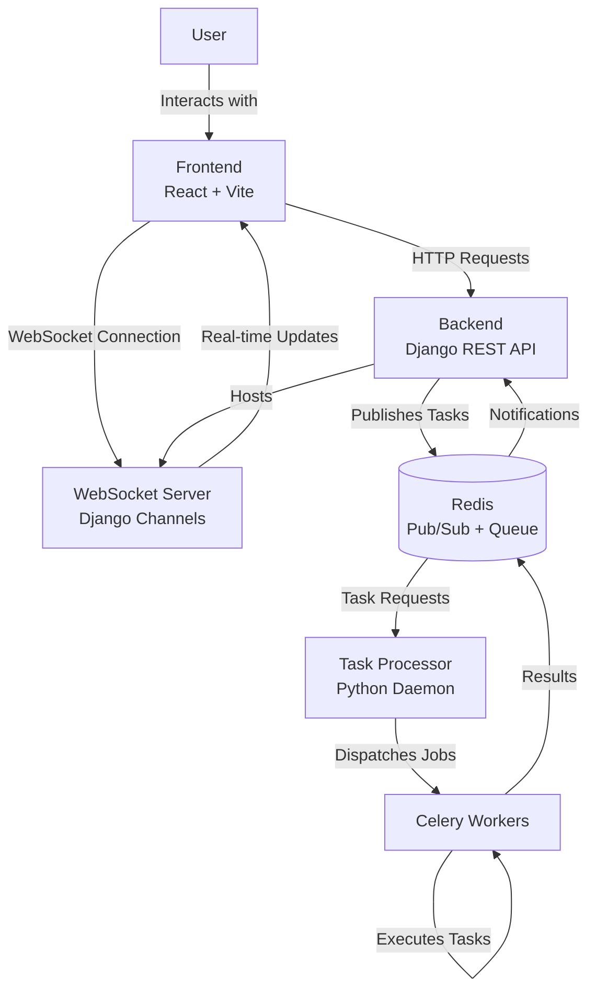

# Event-Driven Architecture Template

A modern event-driven architecture template demonstrating how to offload CPU-intensive tasks from HTTP servers and deliver results asynchronously via WebSockets. This project serves as a complete reference implementation for building scalable, responsive web applications using an event-driven architecture.

## 🎯 Ideal Use Cases

This architecture brings significant value in scenarios such as:

- **Data Processing Applications**: Process large datasets, generate reports, or perform ETL operations asynchronously
- **Media Handling**: Transcode videos, resize images, or apply filters without blocking the main application
- **AI/ML Workflows**: Run machine learning inference, train models, or process natural language without affecting user experience
- **Batch Operations**: Process bulk imports/exports or scheduled tasks efficiently
- **Real-time Dashboards**: Update metrics and analytics in real-time as processing completes
- **High-Concurrency Systems**: Handle thousands of simultaneous requests by offloading work to background processes
- **IoT Applications**: Process incoming sensor data and trigger actions based on results
- **Financial Systems**: Execute complex calculations and generate statements in the background



> **Scalability:** This architecture is designed for horizontal scalability. Each component (Frontend, Backend, Redis, Task Processor, Celery Workers) can be scaled independently based on load requirements. For production deployments, Celery workers can be distributed across a separate server to handle intensive computational tasks without affecting the main application's responsiveness. Redis acts as the central message broker, allowing seamless communication between distributed components regardless of their physical location.

> **Scope and Limitations:** This template implements a basic worker server working isolated from the back and front. For applications requiring per-user (or other kind of) isolation, additional modifications would be needed.

> **Benefits of Event-Driven Architecture:**
> - **Improved Responsiveness:** User requests are acknowledged immediately while processing happens asynchronously
> - **Resource Optimization:** CPU-intensive tasks are offloaded from web servers to dedicated workers
> - **Fault Isolation:** Failures in task processing don't crash the main application
> - **Independent Scaling:** Scale only the components that need additional resources
> - **Real-time Updates:** Users receive immediate notifications when tasks complete
> - **System Resilience:** Message queuing provides buffering during traffic spikes

## 🚀 Features

- **Asynchronous Task Processing**: Offload CPU-intensive operations from your web server
- **Real-time Updates**: Deliver task results instantly via WebSockets
- **Scalable Architecture**: All components can be scaled independently
- **User Authentication**: JWT-based authentication for both API and WebSocket connections
- **Task Management**: Track task status and results

## 🏗️ Architecture

This project implements a complete event-driven architecture with the following components:

1. **Frontend**: React application with Vite and WebSocket client
   - Modern build system using Vite for fast development
   - User interface for task submission and result visualization
   - Real-time updates via WebSocket connection

2. **Backend**: Django REST API with Django Channels
   - RESTful API for task submission and management
   - WebSocket server for real-time notifications
   - JWT authentication for secure connections

3. **Task Processor Daemon**: Python daemon that:
   - Listens for tasks on Redis channels
   - Validates and processes incoming task requests
   - Dispatches tasks to Celery workers
   - Handles task lifecycle management

4. **Workers**: Celery worker processes that:
   - Execute CPU-intensive tasks asynchronously
   - Process tasks in parallel
   - Report results back through Redis

5. **Messaging**: Redis for:
   - Task queue management
   - Pub/Sub messaging between components
   - Result storage and distribution

## 📋 Prerequisites

- Python 3.8+
- Node.js 14+
- Docker (for Redis)
- npm 6+

## 🔧 Installation

1. **Clone the repository**

```bash
git clone https://github.com/juandelmonte/eventdriven_template.git
cd eventdriven_template
```

2. **Set up the backend**

```bash
# Create and activate virtual environment
python -m venv venv
.\venv\Scripts\activate  # Windows
source venv/bin/activate  # Linux/Mac

# Install Python dependencies
pip install -r backend/requirements.txt
pip install -r daemon/requirements.txt
pip install -e .  # Install the package in development mode

# Run Django migrations
cd backend/djangoproject
python manage.py migrate
python manage.py createsuperuser
```

3. **Set up the frontend**

```bash
cd frontend/reactproject
npm install
```

4. **Start Redis**

```bash
docker run --name redis-server -p 6379:6379 -d redis:latest
```

## 🏃‍♂️ Running the Application

You can start all components individually or use the VS Code tasks to start them together.

### Using VS Code Tasks

1. Open the Command Palette (`Ctrl+Shift+P`)
2. Select "Tasks: Run Task"
3. Choose "Start All Services"

### Running Components Individually

1. **Start Redis**

```bash
docker start redis-server
```

2. **Start Django Backend**

```bash
.\venv\Scripts\activate
cd backend/djangoproject
python manage.py runserver
```

3. **Start Celery Worker**

```bash
.\venv\Scripts\activate
celery -A daemon.tasks.tasks worker --loglevel=info --concurrency=1 --pool=solo
```

4. **Start Task Processor Daemon**

```bash
.\venv\Scripts\activate
cd daemon
python processor.py
```

5. **Start React Frontend**

```bash
cd frontend/reactproject
npm start  # Runs Vite development server
```

The Vite development server provides fast hot module replacement and optimized builds.

## 🧪 Testing

Open the WebSocket test client in your browser:

```
http://localhost:3000  # React frontend
```

## 🔍 How It Works

### Task Flow

1. **Task Submission**: 
   - User submits a task through the React frontend
   - Backend validates and stores the task in the database
   - Task request is published to Redis

2. **Task Processing**:
   - Daemon service listens to Redis channel for task requests
   - Daemon validates the task and dispatches it to Celery
   - Celery worker executes the task asynchronously

3. **Result Notification**:
   - When task completes, result is published to Redis
   - Backend listens for results and sends WebSocket notification
   - Frontend receives result via WebSocket and updates UI

### Available Task Types

- **Generate Random Number**: Generates a random number between specified min and max values
- **Reverse String**: Reverses an input string
- *Add custom tasks by extending the Celery tasks module*

## 📁 Project Structure

```
eventdriven_template/
├── backend/                # Django backend
│   └── djangoproject/      # Django project
│       ├── djangoproject/  # Django settings
│       ├── tasks/          # Task management app
│       ├── users/          # User authentication
│       └── template_openapi/ # API documentation
├── daemon/                 # Task processor daemon
│   ├── tasks/              # Celery task definitions
│   └── utils/              # Utility functions
├── frontend/               # React frontend
│   └── reactproject/       # React application with Vite
│       ├── src/            # React source code
│       ├── index.html      # Entry HTML file (Vite specific)
│       └── vite.config.js  # Vite configuration
├── .vscode/                # VS Code configuration
├── config.json             # Application configuration
├── setup.py                # Python package setup file
```

## 🛠️ Customizing

### Adding New Tasks

1. Define a new task function in `daemon/tasks/tasks.py`
2. Add task processing logic to the daemon's `process_message` method in `processor.py`
3. Create a new React component for the task in `frontend/reactproject/src/components/`

### Configuration

Edit `config.json` to modify:
- Frontend host and port
- Backend host and port
- Redis settings
- WebSocket path

### Building for Production

To build the React frontend for production:

```bash
cd frontend/reactproject
npm run build
```

This will create a `dist` folder with optimized production assets that can be served by any static file server.

## 📚 Technologies Used

- **Frontend**: React, Vite, WebSockets, Bootstrap
- **Backend**: Django, Django REST Framework, Django Channels, JWT Authentication
- **Task Processing**: Celery, Redis
- **Tooling**: Docker, VS Code Tasks

## 🤝 Contributing

Contributions are welcome! Please feel free to submit a Pull Request.

## 📄 License

This project is licensed under the MIT License - see the LICENSE file for details.

## 📧 Contact

Juan Del Monte - [GitHub](https://github.com/juandelmonte)

---

*This template is intended for educational and demonstration purposes. It provides a starting point for building event-driven architectures in real-world applications.*